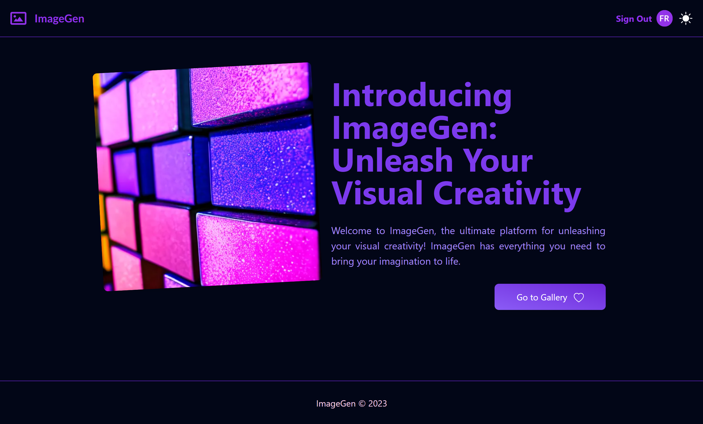
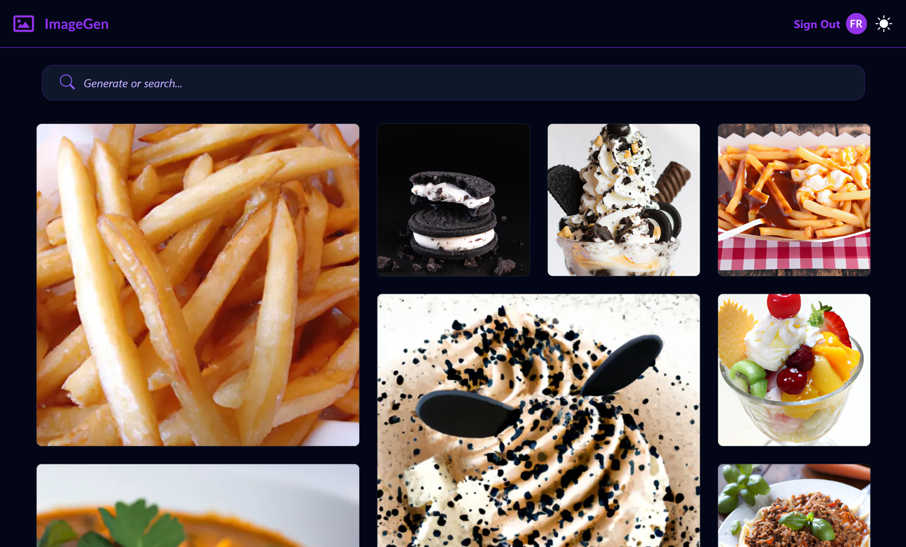

# ImageGen

An AI image generator gallery.

> Website: <https://du8ecttu3enax.cloudfront.net/>

## Features

- [x] Generate Images using AI
- [x] Search images by its prompt
- [x] Preview generated images and see the prompt used
- [x] Delete images
- [x] Dark Mode
- [x] Rate limiting
- [x] Auth
  - [x] Google
  - [ ] Github
  - [ ] Discord
- [x] Images saved to S3 and distributed thought Cloudfront
- [x] Prompt improvement system
  - User can improve a prompt for a more detailed
- [x] Token system
  - User require to use tokens to generate images
- [ ] Token regeneration System
  - Each X days the user recover tokens

## Stack

- NextJS
- T3 Stack (TRPC, Typescript, TailwindCSS)
- Drizzle ORM *(With PostgreSQL)*
- HeadlessUI
- Clerk
- OpenAI
- AWS (S3, Cloudfront)

The deployment is done using `SST` which involve using AWS.

## Screenshots

------------------------
